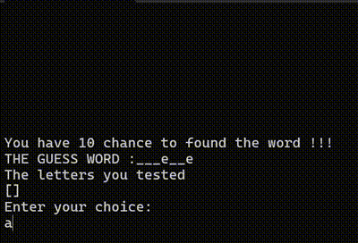
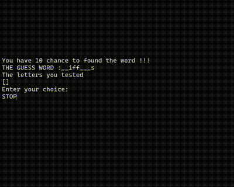
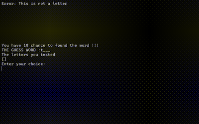

# Project HANGMAN 
This project consists of creating a hangman game. 
___
## Basic instructions
- The program randomly selects a word from a text file.
- The program reveals n random letters in the word, where n corresponds to `len(word) / 2 - 1`.
- The program reads the standard input to store the proposed letter in a variable.
  - If the letter is not present in the word to be found, it displays the appropriate position of the hangman as the number of attempts decreases.
  - If the letter is present, it will reveal all the corresponding letters in the word.
- The programme continues until the word is found, or the number of attempts equals 0.
___
## Basic options
### Hangman-advanced-features :
- The player can suggest either a word or a letter. (A word is a string of at least two character long)
  - If the word is found the game stops
  - If not, the counter of attempts decrease by 2
- The letters proposed by the player are stored so that they cannot propose the same letter twice.
  - An error message is then displayed.
### Hangman-start-and-stop
- If the keyword STOP is written by the player in the standard input.
- The game stops and confirmation is requested.
- If the player confirms, this stops the programme and therefore the game.
___
## Installation
To start the game, execute the command `go run cmd/main.go` in the terminal in the `hangman-basic` folder.
___
## Link to the presentation 
You can click [here](https://www.canva.com/design/DAGTvU8RcwA/MU3fzzg1SiefeD-5hWdasA/edit?utm_content=DAGTvU8RcwA&utm_campaign=designshare&utm_medium=link2&utm_source=sharebutton)
___
## Structure
```console
hangmanProject
├── cmd 
│   └── main.go
├── data
│   ├── picture
│   │   ├── gameplay.gif
│   │   ├── start-and-stop.gif
│   │   └── torolgo.png
│   └── hangman.txt 
│       ├── frenchdictionary.txt
│       └── textfile
├── internal
│   ├── chooser.go
│   ├── game.go
│   ├── printer.go
│   └── verification.go
└── README.md
```
___
## Demonstration

| Gameplay                              | Start-and-Stop                              | Error type                         |
|---------------------------------------|---------------------------------------------|------------------------------------|
|  |  |  |
___
## Contributor
### Dessenne Ylan
<a href="https://ytrack.learn.ynov.com/git/dylan">